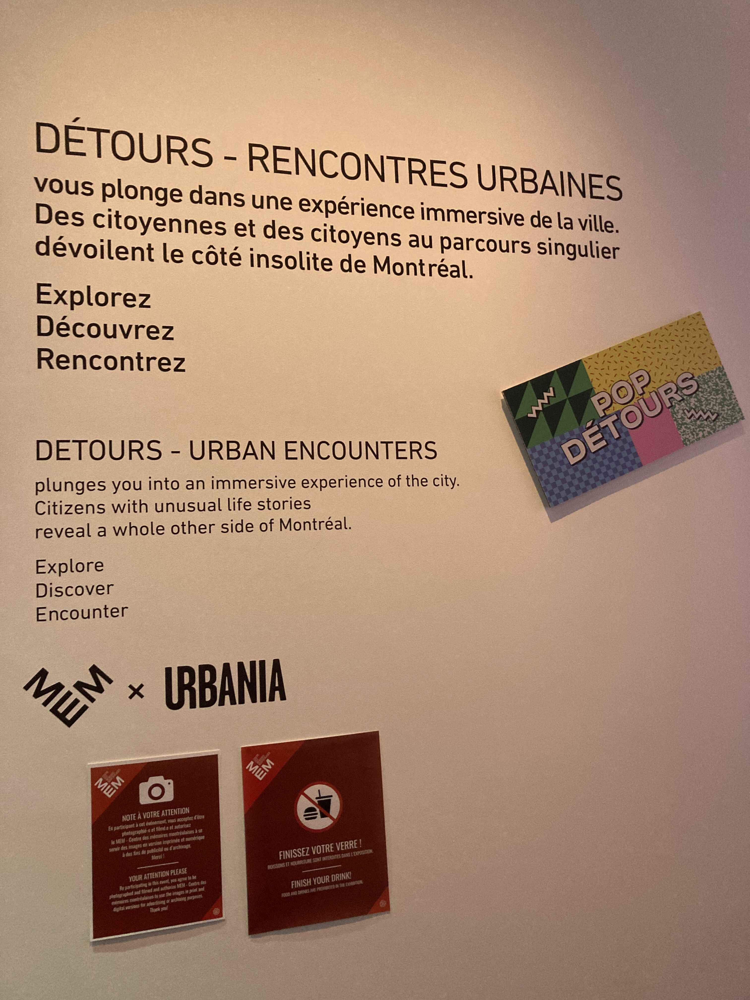
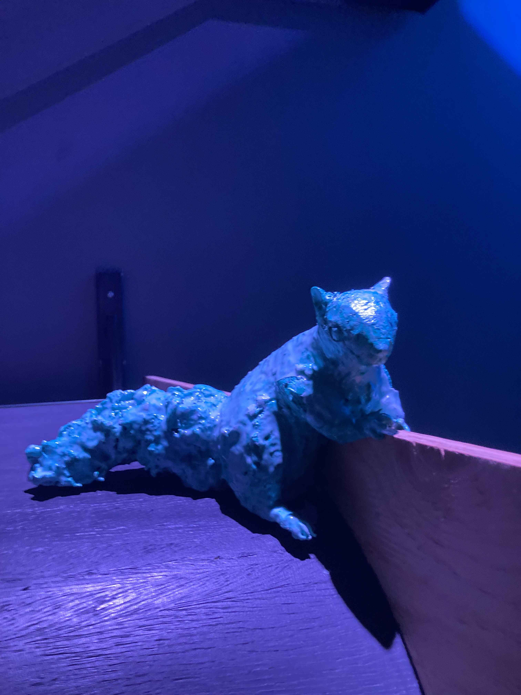
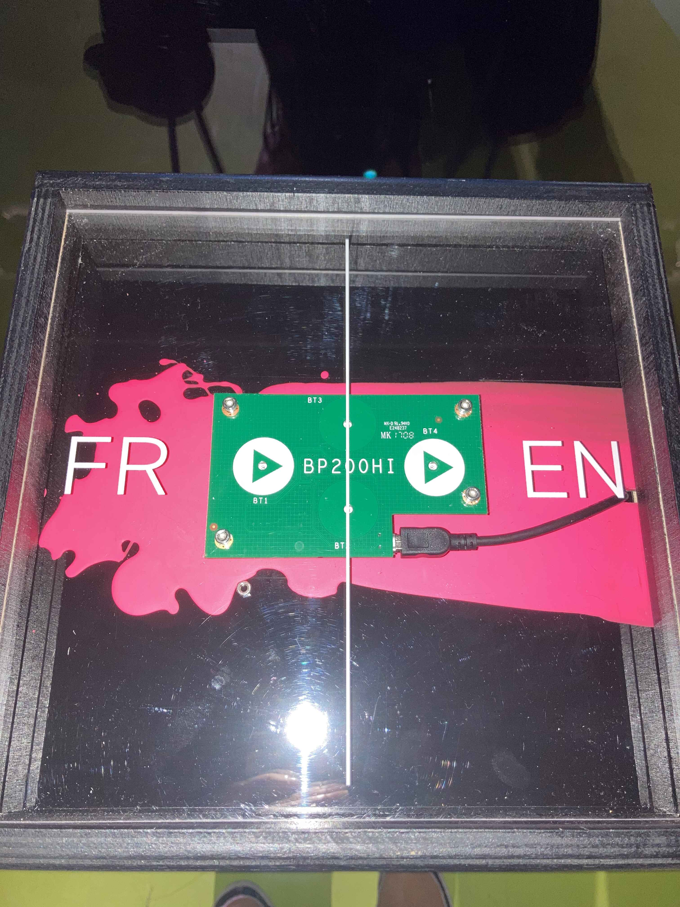
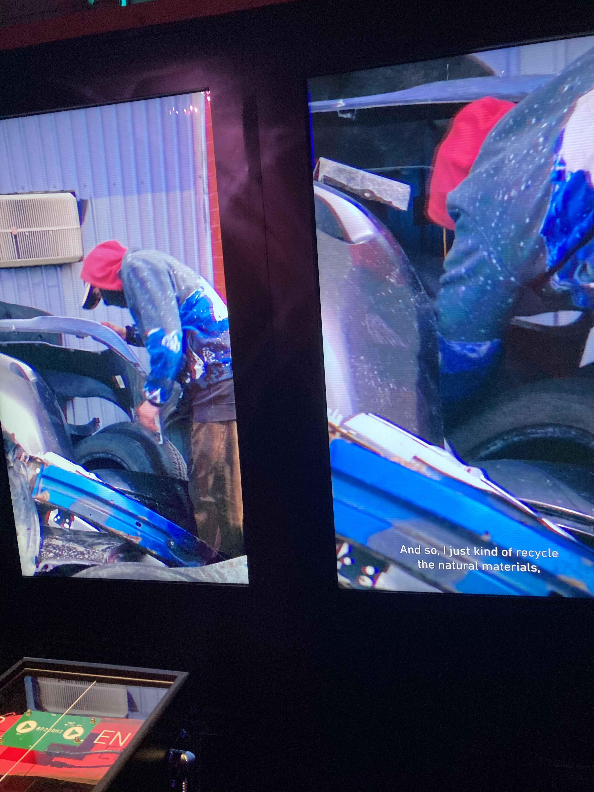
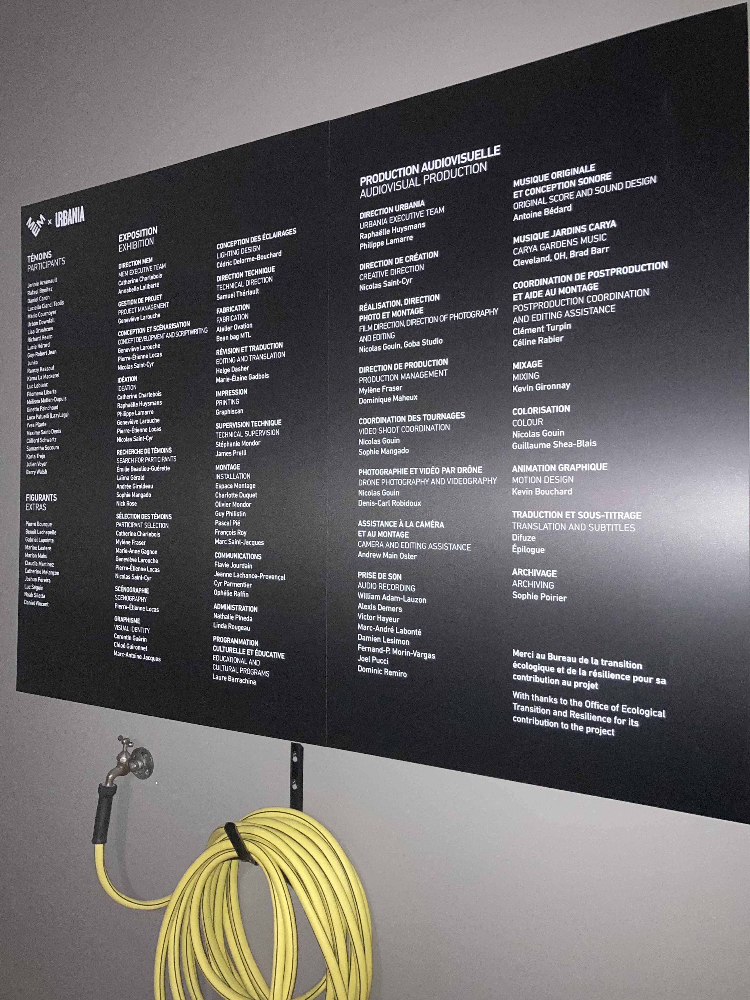

# Détours - Rencontres Urbaines

*Détours - Rencontres Urbaines* est une exposition immersive temporaire au Centre des Mémoires Montréalaises qui mets en scène des montréalais et montréalaises et leurs parcours et expériences uniques.

## Description de l'oeuvre

*Détours* est principalement composée d'une grande pièce éclairée à basse luminosité par des lumières aux couleurs fluorescentes et les écrans des multiples stations.

<video src="./media/panorama.mp4" width="400" controls></video>

Chaque station est un dispositif similaire, faisant jouer des mini-documentaires au sujets des différents invités interviewés dans un petit environment décoratif qui fait lien avec le sujet.

## Le Dispositif

Les dispositifs sont tous principalement composés de trois éléments:
- un ou plusieurs écrans (pour la vidéo du mini-documentaire)
- un piédestal contenant une planche avec deux activateurs photosensibles (pour sélectionner la langue de l'audio; le sous-titrage prends alors l'autre langue pour toujours être compréhensible bilinguement)
- des écouteurs (pour écouter le mini-documentaire)

## Expérience personelle

Bien que les dispositifs étaient essentiellement les mêmes, juste dans des décors ou à des échelles différentes, l'exposition était plus axée sur les personnes elles-mêmes; c'est, après tout, le Centre des *Mémoires Montréalaises*.

J'ai bien apprécié la variété des perspectives des gens sélectionnés, et au final je me suis plus rapellé de leus histoires que de l'environnement temporaire dans lequel ils étaient exposés.

## Références & Crédits

Toutes photos prises par moi, William Briand.