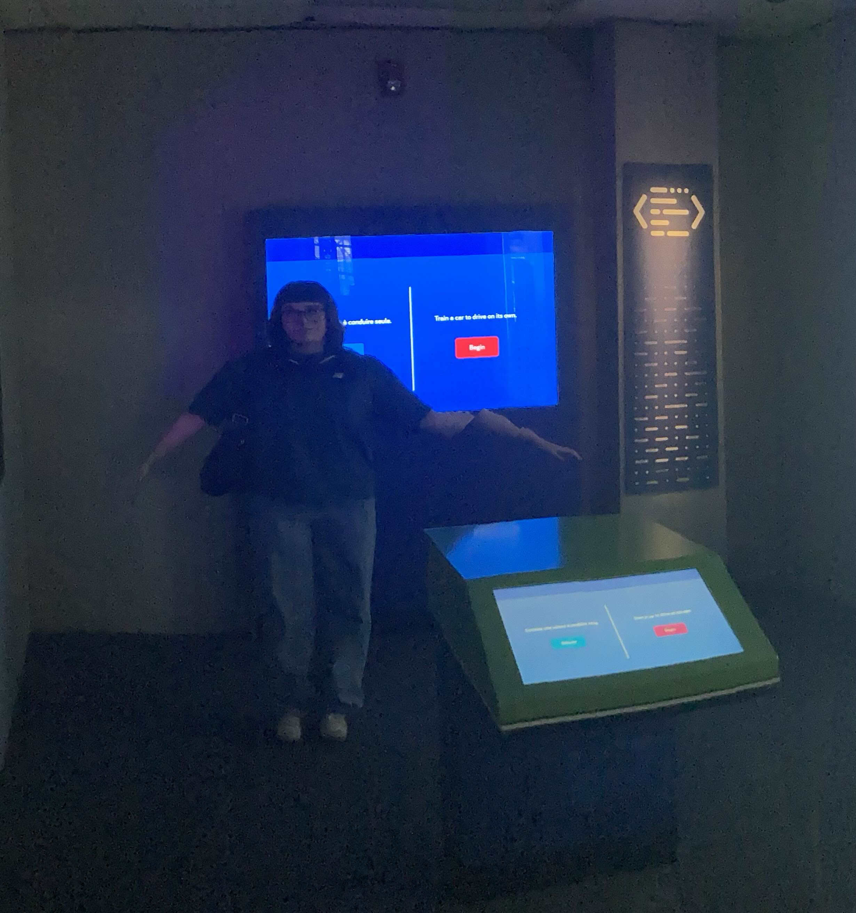
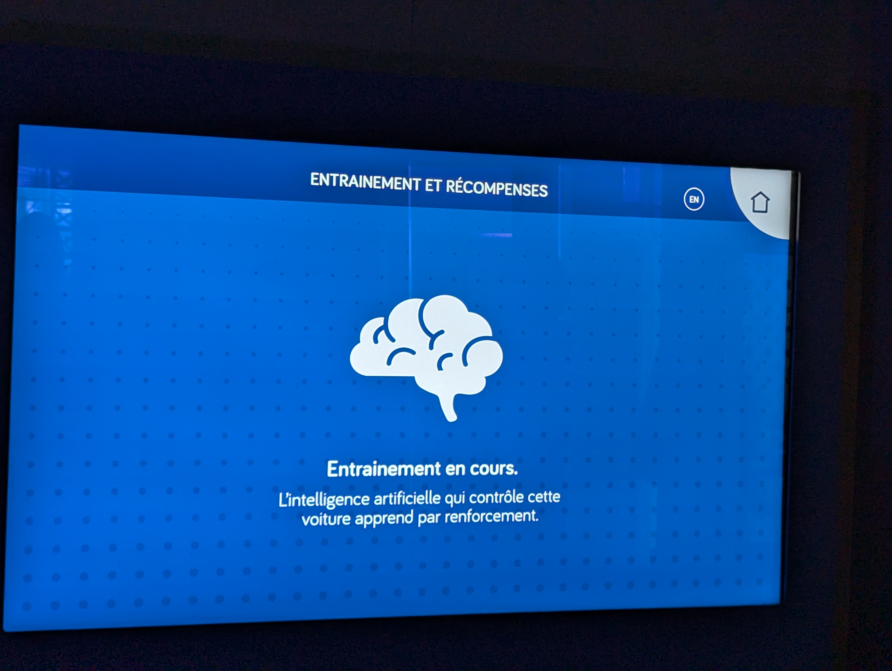
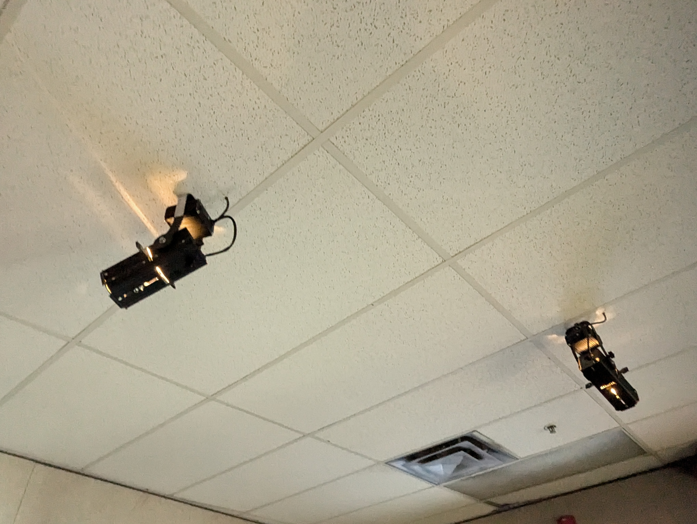
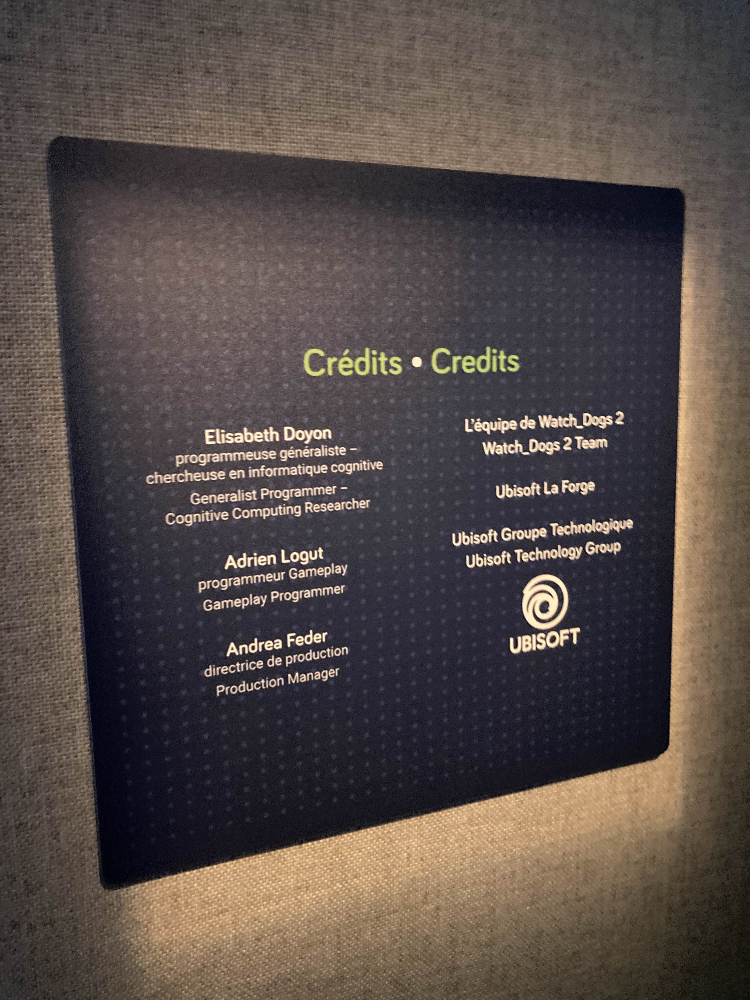
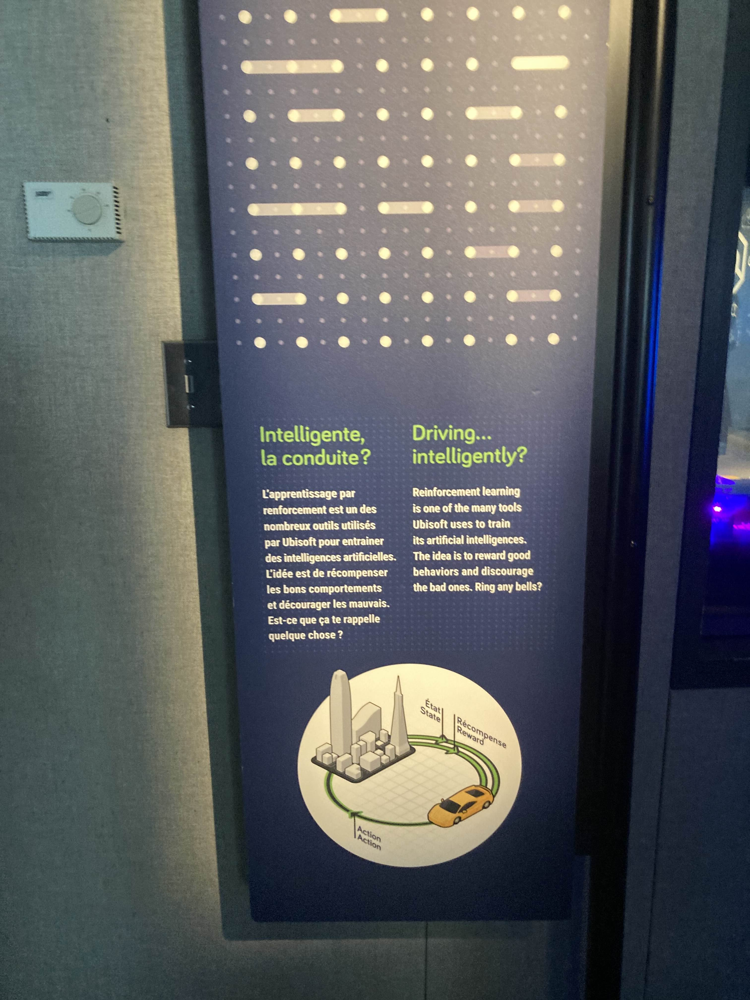

# Intelligente, la conduite?
### Un dispositif d'Ubisoft

 

L'installation interactive "Intelligente, la conduite?" d'Ubisoft fait partie de l'exposityion permanente "Explore - La science en grand" du Centre des Sciences de Montréal.

Étant donné que la seule vue d'ensemble que j'ai pris est de piètre qualité (à cause de la médiocrité de la caméra de mon téléphone) et mets en scène l'édition distordue de Delphine --

-- je vais emprunter des images de [mon camarade Sean](https://github.com/LishunSLD), qui observait aussi cette même installation le jour de notre visite le 31 janvier:

L'installation comprend deux éléments principaux, soit la console de contrôle principale et un plus grand écran permettant aux autres personnes dans la pièce de plus facilement observer ce qui se passe.

La console présente plusieurs paramêtres que l'utilisateur peut modifier à l'aide de l'écran tactile et de l'interface graphique. Ces paramêtres serviront ensuite à entrainer le modèle d'intelligence artificielle basée sur l'apprentissage par renforcement, que cette instalation présente par la simulation d'une voiture à conduite autonome.

  

Étant donné que l'installation se retrouve dans une pièce dédiée, le Centre des Science a utilisé des projecteurs de lumière pour éclairer les environs de l'installation.

  

## Mon expérience

J'ai bien aimé cette installation, bien qu'elle n'entre pas en détail sur les méthodes et la logique derrière les modèles d'apprentissage par renforcement. Cela fait plusieurs fois que je vais au Centre des Sciences et puisque cette pièce fait partie d'une installation permanente, elle est là sans changements depuis plusieurs années, mais demeure tout de même intéressante.

### La visite

C'est toujours bien de pouvoir sortir de la salle de classe et aller observer en personne. J'aime toujours pouvoir partager toutes les petites anecdotes et faits divers que j'ai accumulé à propos des divers sujets présentés.

## Références
*Centre des sciences de Montréal.* (s. d.). Centre des Sciences de Montréal. https://www.centredessciencesdemontreal.com/

Année de réalisation inconnue.

