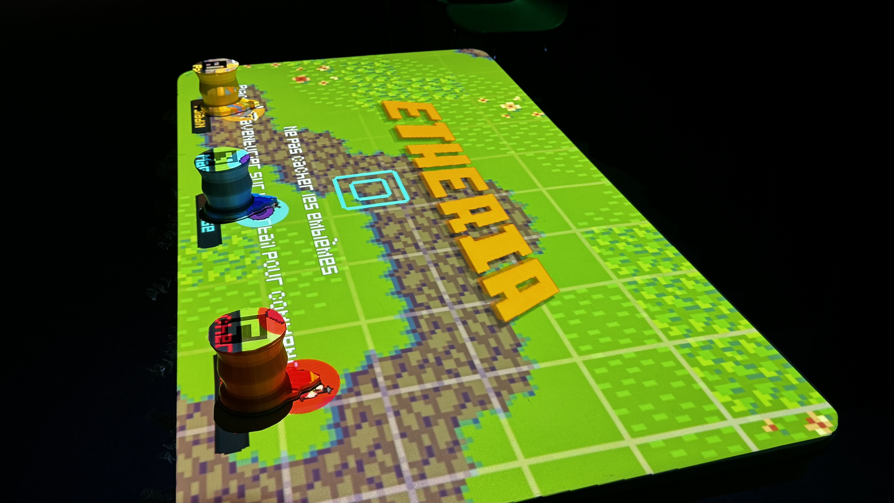
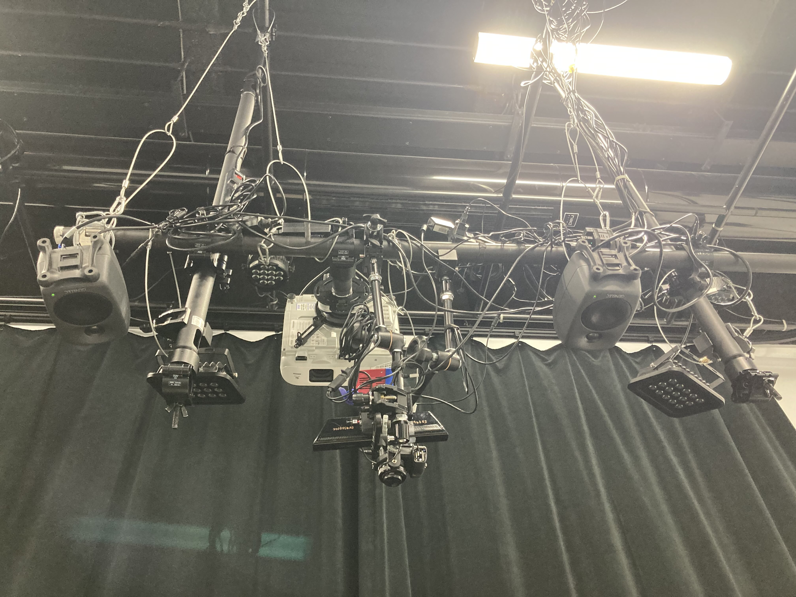
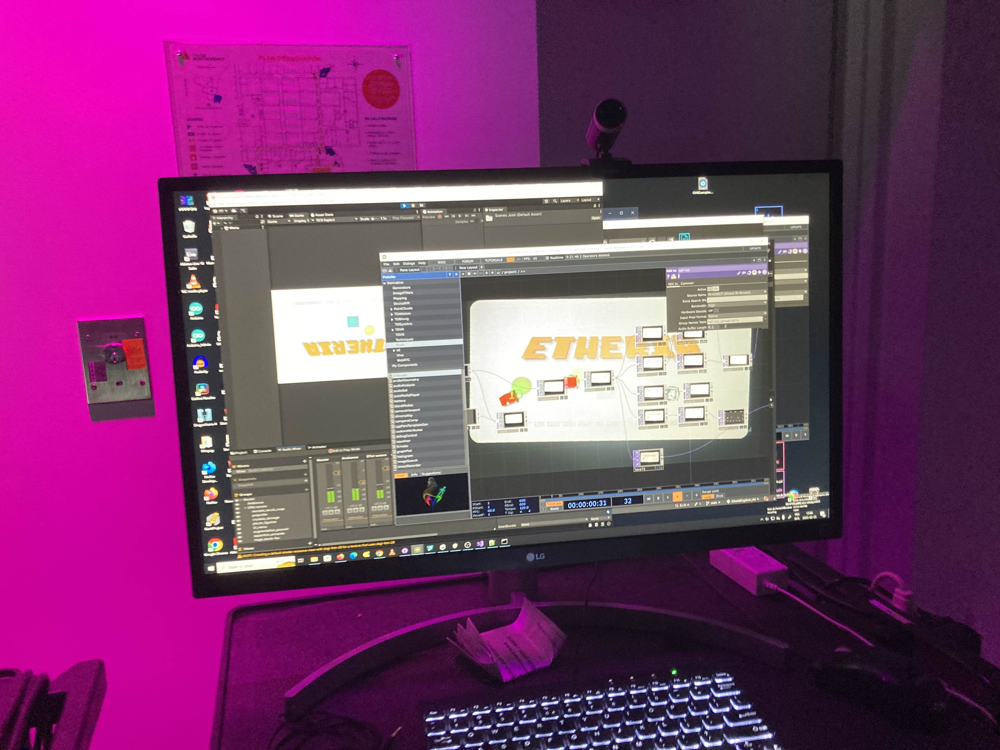

# Etherea

Parmi les projets de l'exposition temporaire "Résonnance", j'ai préféré Etherea au-dessus des autres. Nous avons visité les projets finissants en cours le 25 février 2025. L'équipe travaillant sur Etheria est composé de Maik Hamel, Michael Un Dupré, Victor Gileau, Joshua Gonzalez-Barrera et Pierre-Luc Proulx.

Le jeu se déroule sur une table blanche qui sert de surface de projection. Les personnages joueurs sont contrôlés par des jetons avec un nexcode imprimé sur le dessus. 

 

## Mise en espace

La disposition physique d'Etherea est principalement composée d'une table blanche avec une herse chargée de matériel audiovisuel et d'un chariot où est entreposé le système électronique qui contrôle le jeu.

 

## Composantes et techniques

Etheria fait usage de plusieurs composantes affixées à une herse suspendue au-dessus de la table de jeu. Nottament, les haut-parleurs et le projecteur pour le rendu audiovisuel du jeu, ainsi qu'un combo émetteur-capteur infrarouge qui permet au système du jeu de détecter la position et l'orientation des joueurs à l'aide du nexcode imprimé sur le dessus des jetons.

 

## Mon expérience

J'ai toujours été intéressé par les technologies de codes barre ou 2d, donc leur utilisation dans le jeu a initialement piqué mon intérêt. Leur usage comme pont entre le physique et le numérique forme un support principal de l'aspect multijoueur que j'ai bien aimé, avec à un certain moment une certaine bousculade comique avec tous nos bras dans l'espace de jeu.

 

## Références

*Etheria.* (s. d.). https://ethereal-creators.github.io/Etheria/#/