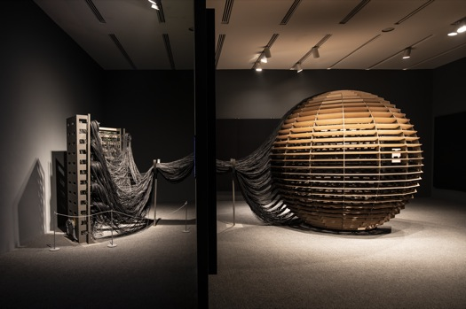

# Résumé de la conférence de Jade Seguela

## Sphere Packing: Bach
Conçue par Rafael Lozano-Hemmer en collaboration avec son équipe, "Sphere Packing: Bach" est une œuvre immersive installée à l'échelle de 3 mètres sur 3 mètres. Elle se compose d'une sphère en bois pesant 300 kilos et de 1128 haut-parleurs distribués autour de la sphère. 

Ces haut-parleurs diffusent les compositions musicales de Johann Sebastian Bach. En entrant dans la sphère, on est plongé dans une cacophonie de sons, créant une atmosphère unique et stimulate.

## Shadow Tuner
Faisant pertie de l'exposition "Translation Island" s'étant déroulée à Abu Dhabi de novembre 2023 à janvier 2024, le *Shadow Tuner* est une projection d'une carte du monde sur un globe, formant la Terre. De plus, des stations de radio de toutes parts du monde sont relayées dans l'environ. 

En produisant des ombres sur la surface du globe, les visiteurs peuvent isoler la cacophonie à des stations locales spécifiques. Jade Seguela faisait mention de la difficulté de l'assemblage et de l'entretien de cette oeuvre, car elle était située en plein air sur une petite île artificielle, à la merci des éléments.

## Références

*Rafael Lozano-Hemmer - Sphere Packing : Bach.* (s. d.). https://www.lozano-hemmer.com/sphere_packing_bach.php

*Rafael Lozano-Hemmer - Shadow Tuner.* (s. d.). https://www.lozano-hemmer.com/shadow_tuner.php